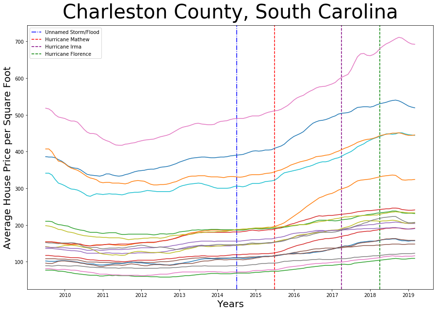
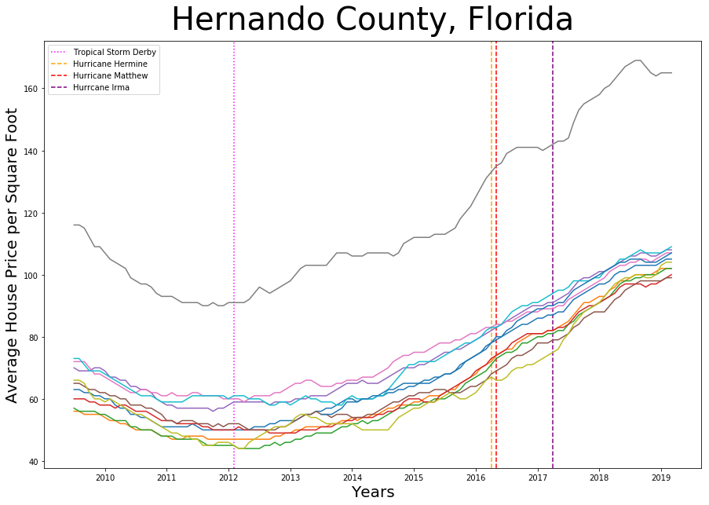
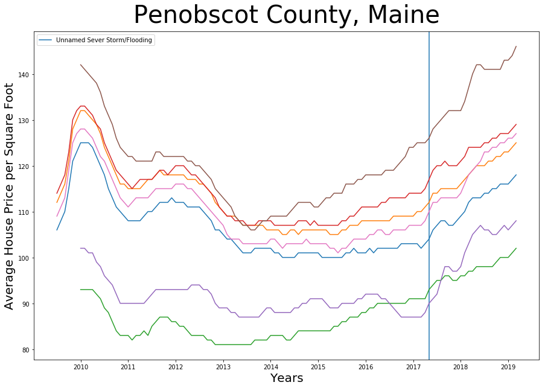

# The Impact of Natural Disasters on US Real Estate

It is important to determine the impact that natural disasters can have on property values. There are several real world applications to a tool that can analyze data and predict the impact that a natural disaster will have on property values:
Investment firms looking to invest in the real estate market in a specific location.
Insurance companies determining premiums on homeowners insurance.
Individuals looking to purchase real estate either as an investment or as a place to live.

### Problem Statement

We were approached by a client to determine the following:
Do natural disasters impact real estate prices?
Can we develop a tool that allows instantaneous viewing of property value metrics according to zip code:
>Mean
>Median
>Maximum
>Minimum

**Getting Started**

In order to complete the tasks laid out for us in the previous section, we initiated two work streams:
Conducting a rigorous Exploratory Data Analysis to look for trends in real estate prices and natural disasters.
Created a web-based tool allowing users to enter a zip code and see a variety of statistical metrics regarding real estate prices and natural disaster occurrence.

### Analysis

Since 2014, Charleston County, South Carolina has suffered from three named hurricanes and one major storm that caused severe flooding in much of the county. During this time, house prices have shown no clear reaction to the disasters. The unnamed storm and flooding in early 2015 can be argued to have briefly halted the growth pattern that had begun in mid 2014, but a nearly identical bump appeared again about 6 months later with no storm to blame it on. Most zip codes even had a major growth in prices the month right after Hurricane Mathew and neither Irma nor Florence had any clear effect whatsoever. And this is despite Irma costing the county an estimated one to two billion in damages.

Hernando County, Florida shows a similar pattern. It has been hit by a Tropical Storm and three named hurricanes since 2010. The Tropical Storm in mid 2012 hit about when the recovery from the 2008 housing crash had started to begin, and the storm did not stop the upward trend that began shortly after. The wealthiest zip code in the county did have a clear drop shortly after Hurricanes Hermine and Matthew, but the trend was not shared by the remaining nine zip codes. That same wealthy zip code also had a boom slightly after Hurricane Irma, though again the rest of the zip codes were seemingly unaffected.

If we compare those two counties, which have been highly affected by natural disasters in the past few years, with a county in Maine that has had almost no natural disasters, we can see even more clearly how little effect natural disasters have. Penobscot County, Maine has only had one unnamed severe storm with flooding in late 2017. A few of the zipcodes have a slight drop a month or so after the flood, but if you saw this graph without the storm marked, you would not have been able to guess when the storm had happened. The slight drop in early to mid 2015, the stunt in late 2016, and the drop in later 2018 all look are each a more significant change in the housing market.

### The tool:
For this project, we thought it would be very useful to create a web app with which our client could access all the available data we had gathered, and use it however they see fit. 

**Why create a tool:**
The idea was that, through the creation of this app, our project wouldn't be limited to just a report consisting of some special cases in which natural disasters had affected the prices of households in a certain area, but it would rather cover every scenario. 

**Data used:**
We had mainly been working with two datasets:
- [Disasters By Zip Code](./datasets/Disasters By Zip Code)
- [Sale_Prices_Zip](./datasets/Sale_Prices_Zip.csv)

We chose these datasets because they gathered large amounts of information, and, most important of all, because they classified their information by 'zipcodes'. We chose to focus on zipcodes over every other type of classification (e.g. county, city, state) because it offered a more clear view of the real effect of natural disasters on real estate prices. Most natural disasters don't affectevery household in a state, city, or county, but only a few households. Therefore, the smaller the area, the more specific we can be about the real effects of these natural disasters. 

**Creating the tool:**
The tool was created using the python tool [flask](https://pypi.org/project/Flask/). Through the use of this tool, we were able to create a simple web app which served our needs, and hopefully those of the client. The app can be run on any computer, and also includes the option of hosting the server so that users using the same wifi can access it by simply loading into the IP of the host user. In other words, it is not an app that is constantly running online, but rather it needs to be hosted locally. Further improvements could be carried out in the future to make the web app exist within a domain online. 

The tool accesses the datasets mentioned aboove and creates graphs and tables displaying relevant information about the zipcode which the user has written into the app. While creating the tool, we also thought it could result helpful to include some 'zipcode examples'; therefore, we included the zipcodes that had been most affected during the time of huracanes: 'Matthew', 'Irma', and 'Florence'. These are merely to give some zipcodes to any user interested in seeing the effects of these natural disasters on some zipcodes.

**How the tool works:**
The tool works in three simple steps:
> Login into the app
> Writing the zipcode which you want to inspect
> Get the information regarding natural disasters and average real estate household price

The data displayed consists of a graph which shows the average household prices over time, and some general information such as:
- The largest change in prices (could be positive or negative) and the month it ocurred
- The current mean, median, max, min, and average price of the household in that zipcode (listed on [zillow](https://www.zillow.com/). 
- The latest natural disasters recorded in that zipcode.

**Final remarks about the tool:**
While the tool is simple, hopefully it addresses the needs of our client and gives them relevant information about the extent to which natural disasters affect real estate prices (by zipcode). As it has already been mentioned, it serves a very specific purpose, and further work could be done to improve its services.

## Conclusion

Natural disasters can impact property values. However, they are one of the least important determinants of property values. Factors such as the strength of the economy, interest rates, and consumer sentiment all have substantially larger impacts on the overall strength of the economy. Our research even indicates that hurricanes often lead to a rise in home prices, an opinion echoed by a 2018 [Forbes](https://www.forbes.com/sites/jordanlulich/2018/06/25/does-hurricane-damage-negatively-impact-your-real-estate-value/#169ef277107b) article.

